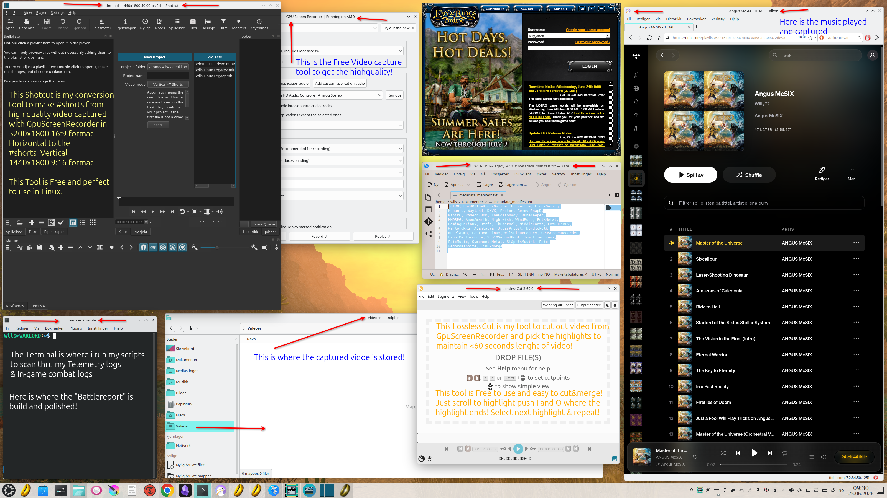

# Wils Method - Efficient YouTube Shorts Production Workflow

Welcome to the official repository documenting the **Wils Method**—an optimized, high-performance workflow designed for Linux enthusiasts and content creators who want to produce pristine 9:16 vertical YouTube Shorts from high-resolution 16:9 widescreen raw gameplay (e.g., 3200x1800) with absolute minimum effort and zero guesswork.

---

## 🇳🇴 Norsk: Wils-metoden (Definert 26. juni 2026)

Mange innholdsskapere kaster bort timer på å kjempe mot ustabile terminal-skript, tunge gjencode-prosesser eller nettleserbaserte redigeringsverktøy som fryser. **Wils-metoden** fjerner all frustrasjon ved å dele produksjonen inn i logiske, visuelt kontrollerbare steg som tar vare på råvarekvaliteten (f.eks. HEVC 10-bit) hele veien til publisering.

### 🎥 Arbeidsflyt og Koreografi

#### 1. Optimalisert Capture (Fundamentet)
* **Kildeoppsett:** Gjør opptak av spillet (f.eks. LotRO via GPU Screen Recorder) i din rå, brede oppløsning (3200x1800 16:9) med maksimal kvalitet.
* **Hvorfor:** Ikke prøv å tvinge grafikkmotoren eller spillvinduet inn i høykant før opptak. Det krøller til Gaming Dashboards, strekker UI-elementer og ødelegger spillopplevelsen. Behold kilden rå og bred.

#### 2. Kirurgisk utvelgelse (LosslessCut / LosslessFfmpeg)
* **Verktøy:** LosslessCut.
* **Prosess:** Ta den fulle fullversjonsfilen av oppdraget ditt etter opplasting, og skip den rett inn i LosslessCut for å klippe ut nøyaktig de mest verdtøysfylte høydepunktene. Sørg for at klippet samples og merges til rett under 60 sekunder (f.eks. 54-55 sekunder).
* **Hvorfor:** Tapsfri trimming uten re-enkoding sparer maskinkrefter og bevarer den originale pixel-perfekte kvaliteten 100% på et blunk.

#### 3. Visuell konvertering og formatering (Shotcut)
* **Verktøy:** Shotcut (Installert stabilt via Flatpak).
* **Prosess:**
  * Opprett et prosjekt med et låst vertikalt format (**9:16**, f.eks. 1440x2560 eller tilsvarende).
  * Dra inn det ferdige 54-55-sekunders høydepunktsklippet ditt.
  * Bruk de grafiske verktøyene for **Crop / Position / Zoom** til å flytte rammen live over skjermen til nøyaktig der magien skjer (slik at karakteren og kamp-loggen sitter bankers i sentrum).
  * Kompiler og eksporter ut den endelige, "lette" `.mp4`-filen.
* **Hvorfor:** **Visuell bekreftelse er din fasit.** Du ser nøyaktig hva som havner på skjermen før du eksporterer. Ingen 0-byte filer, ingen mislykkede skript-fadeser. Nettleseren din vil aldri mer henge seg opp i YT Studio fordi filen er ferdig optimalisert lokalt.

#### 4. Algoritmisk Metadata-synkronisering
* **Prosess:** Last opp fullversjonen av oppdraget ditt først med dine emneknagger og metadata. Når du publiserer din Short, legger du inn *akkurat det samme navnet* og de samme emneknaggene (justert slik at du akkurat smyger deg under grensen på 5000 tegn).
* **Hvorfor:** Dette hamrer inn koblingen i YouTube-algoritmen, slik at den forstår at langformat- og kortformat-videoene dine hører sammen, noe som sikrer en jevn strøm av organisk trafikk.

---

## 🇺🇸 English: The Wils Method (Established June 26, 2026)

Many content creators waste hours fighting brittle terminal scripts, heavy re-encoding processes, or web-based editors that freeze up. **The Wils Method** eliminates technical friction by splitting production into logical, visually verifiable steps that safeguard raw capture quality (e.g., HEVC 10-bit) all the way to release.

### 🎥 Production Workflow & Choreography

#### 1. Optimized Capture (The Foundation)
* **Source Setup:** Capture your gameplay (e.g., LotRO via GPU Screen Recorder) in your native widescreen resolution (3200x1800 16:9) at maximum quality settings.
* **Why:** Never force the game engine or window into a vertical layout before recording; doing so corrupts the Gaming Dashboard, stretches UI layouts, and ruins gameplay. Keep the source raw and wide.

#### 2. Surgical Selection (LosslessCut)
* **Tool:** LosslessCut.
* **Process:** Take the full mission video file, drop it into LosslessCut, and extract the precise highlights worth sharing. Ensure the final cut & merge sits tightly under the 60-second limit (ideally 54-55 seconds).
* **Why:** Lossless trimming without re-encoding saves system resources and preserves 100% of the original pixel quality instantaneously.

#### 3. Visual Conversion and Framing (Shotcut)
* **Tool:** Shotcut (Installed cleanly via Flatpak).
* **Process:**
  * Open a project locked to a vertical **9:16** video mode (e.g., 1440x2560).
  * Import your 54-55-second lossless highlight clip.
  * Use the visual **Crop / Position / Zoom** filters to drag the framing frame directly over the active zone, ensuring the character and combat log are dead-center.
  * Compile and export the optimized, "lightweight" `.mp4` file.
* **Why:** **Visual confirmation is your safeguard.** You see exactly what goes into the frame before rendering. No 0-byte files, no terminal mishaps. YouTube Studio will never freeze up because the file is pre-optimized on your local rig.

#### 4. Algorithmic Metadata Synchronization
* **Process:** Upload your full-length mission video first with all your tags and metadata. When uploading the Short, apply the *exact same title* and identical tags/metadata (trimmed slightly to slide right under the 5000-character ceiling).
* **Why:** This synchronizes the content inside the YouTube algorithm, signaling that your long-form anchor video and short-form highlight belong together, keeping your channel traffic flowing smoothly.

---

## 📊 Visual Blueprint / Teknisk Kart

Below is the definitive layout of the Wils Method architecture, showcasing how wide raw streams effortlessly adapt to pristine vertical delivery:

This is the way!

Wils
